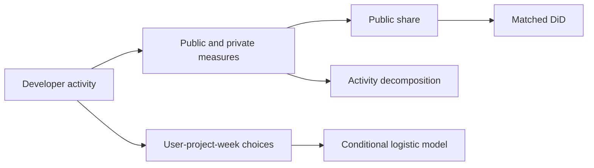

# How Generative AI Changes Effort Allocation

**Behavioral analytics · Causal inference · KPI design · Discrete-choice modeling**

I examined whether access to generative AI changes where knowledge workers direct their effort. Using developer activity around Italy's temporary ChatGPT suspension, I analyzed the balance between public and private contribution and the decision to engage with new projects.

> **Key finding:** Losing access to ChatGPT reduced the share of developer effort directed toward public contribution by approximately **3%**, with a stronger response among more experienced developers.

This is a relative change in the public-share measure, not a three-percentage-point decrease.

## The problem

Total activity can conceal a shift in behavior. A developer may maintain similar overall activity while doing less work that others can inspect, reuse, or build upon. I framed the analysis around effort allocation: whether AI changes the proportion of observable activity devoted to public contribution and the breadth of engagement across projects.

## My contribution

I led the research question, outcome design, data preparation, matching, causal analysis, validation, and interpretation. I constructed longitudinal measures of public and private contribution and modeled new-project entry on a **user-project-week panel using conditional logistic regression**. This connected an aggregate allocation effect to a specific behavioral decision: whether to engage with a new project.

The study draws on the shared research pipeline spanning approximately **680,000 developers, 2 million repositories, and 13.6 million user-week observations**. Those totals describe the broader data resource; model-specific samples apply their own matching and eligibility rules.

## How I approached it

1. **Define the behavioral KPI.** Measure public contribution as an aggregate of seven public activity types. Construct public share relative to public plus private contribution; distinguish no observed activity from an observed share of zero.
2. **Build the developer-week panel.** Align activity, country, experience, and calendar information. Treat private contribution as an available activity measure, without claiming access to private source code or the content of private work.
3. **Create comparable cohorts.** Match Italian developers to developers in France and Portugal using pre-treatment profile and behavior measures.
4. **Estimate the allocation effect.** Apply matched difference-in-differences with developer and week fixed effects and developer-clustered inference. Analyze public share and its public/private components separately.
5. **Investigate the mechanism.** Decompose public activity into commits, pull requests, reviews, issues, repository creation, and discussions to distinguish which contributions respond.
6. **Model project entry.** Use conditional logistic regression on a user-project-week panel to examine new-project engagement and differences by experience. Treat the eligible project set and conditioning groups as explicit modeling decisions.

## Findings and why they matter

The decrease in public share was driven primarily by reduced public work, rather than increased private activity. Effects were concentrated in codification-intensive activities and the breadth of cross-project engagement. The project-entry analysis showed that AI access broadened cross-project engagement, with differences by experience.

The novel contribution is to examine **which activities receive effort**, alongside how much work gets done. In a business setting, the same analytical distinction matters when interpreting adoption, engagement, collaboration, or community-health metrics: a top-line total can hide a meaningful change in its composition.

## Analytical judgment

- **Shares require a denominator policy.** Weeks with no observed activity do not supply a meaningful public/private allocation ratio.
- **Activity is a proxy for effort.** Contribution counts do not directly measure time spent or cognitive effort.
- **Composition matters.** Decomposing a ratio helps explain whether its numerator, denominator, or both changed.
- **Choice sets matter.** An entry model can be misleading if its alternatives use future information or omit realistic opportunities.
- **Identification remains conditional.** Matching improves observed comparability; it cannot by itself remove unobserved differential shocks.

## Explore the work

| Sample | What it demonstrates |
|---|---|
| [Allocation features](allocation_features.py) | Public contribution, denominator handling, and share construction |
| [Project-entry design](project_entry.py) | Representative conditional-logit design and within-group variation checks |
| [Effect interpretation](effect_interpretation.py) | Relative effects versus percentage-point changes |
| [Methodology](methodology.md) | Causal design, decomposition, and project-choice interpretation |

**Underlying study:** *Generative AI and Effort Allocation in Knowledge Work.*

## About the code

This is a curated research showcase. The Python files are condensed, refactored examples of selected workflows, with representative reconstructions where the full proprietary implementation is not included. They are designed for code review, not as a runnable replication package. Research results below describe the completed studies; the samples do not reproduce those estimates.

The confidential dataset, original collection archive, credentials, and proprietary production code are not distributed. See [sample provenance and scope](code-notes.md).

## Research and contact

**Sardar Fatooreh Bonabi** · Data Science · University of California, Irvine  
[GitHub](https://github.com/SardarBonabi/) · [LinkedIn](https://www.linkedin.com/in/sardarb/)

This portfolio presents my contributions to collaborative doctoral research. Manuscript titles identify the underlying studies; no journal acceptance or publication status is implied.
