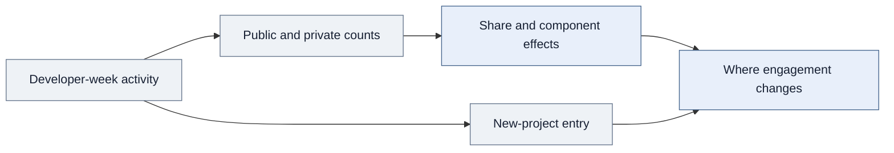

<div align="center">

# Does AI Increase Participation in Shared Projects?

Understanding where user activity goes—and what engagement totals can hide.

**Behavioral analytics · Metric design · Causal inference · Choice modeling**

[Decision](#the-product-decision) · [Results](#results-and-interpretation) · [Approach](#analytical-approach) · [Code](#explore-the-implementation)

</div>

## The product decision

**Does an AI tool strengthen participation in a shared developer ecosystem, or change where users direct their activity?**

For a platform built around shared projects, total activity is only part of the picture. Public contributions can be inspected, reused, and built upon by others. Private contributions represent a different allocation of activity. A team evaluating engagement needs to understand both the total and its composition.

I measured the share of activity directed toward public contribution and examined participation in new projects. Using Italy's temporary ChatGPT suspension as an external change in access, I estimated how these behaviors changed relative to developers in France and Portugal.

## Results and interpretation

| Evidence | Product meaning | Interpretation boundary |
|---|---|---|
| **Approximately 3% relative decrease in public share during lost access** | Access to the tool affected the composition of participation | This is not a three-percentage-point decrease or a measured change in time spent |
| **Reduced public work drove the share decrease** | A ratio's components explain what changed in engagement | The result should not be described simply as users doing more private work |
| **Stronger response among more experienced developers** | An average engagement effect can conceal segment differences | Experience patterns motivate product hypotheses; they do not establish a targeting strategy |
| **AI access broadened cross-project engagement** | Participation breadth adds information beyond contribution volume | Project entry is distinct from sustained adoption or retention |

The response was concentrated in codification-intensive activities and the breadth of cross-project engagement. **The decision-relevant finding is that access can influence where contributions go, alongside how much activity occurs.**

## How this would inform an engagement strategy

| Product question | Measurement or evaluation choice |
|---|---|
| Is the shared ecosystem becoming more active? | Pair public share with public volume, private volume, and total activity |
| Are users exploring more of the platform? | Measure new-project entry separately from repeated activity in existing projects |
| Which users respond? | Examine experience segments before interpreting the population average |
| Would an onboarding or discovery change help? | Use the observed entry patterns to formulate a subsequent product experiment |

These are applications of the analysis, not interventions tested here. Revenue, retention, and the business value of individual contributions were not measured. Public participation is relevant to a shared ecosystem; it is not automatically the preferred outcome for every developer or product.

## Analytical approach

### 1. Build an engagement metric with an explicit denominator

I aggregated seven public activity types: repository creation, commits, pull requests, reviews, discussion initiation, discussion answers, and issues.

```text
public_share = public_contributions / (public_contributions + private_contributions)
```

The developer-week panel aligns activity, country, experience, and calendar information. Private contribution measures do not imply access to private source code or its contents. Counts are behavioral proxies, not observed hours of effort.

The public sample leaves shares undefined for zero-total weeks and rejects incomplete counts. That is an illustrative denominator policy; the confidential research inclusion rules are not distributed. The [metric dictionary](data-dictionary.md) explains these distinctions and why averaging user shares differs from pooling activity.

### 2. Separate changes in behavior from differences between users

I used pre-treatment matching and **difference-in-differences with developer and week fixed effects**, comparing Italy with France and Portugal. Developer-clustered inference accounts for repeated observations. The manuscript uses a Poisson framework and reports incidence-rate ratios.

I analyzed public share alongside public and private counts, then decomposed public activity by type. This links an aggregate ratio movement to the behaviors responsible for it.



### 3. Model the decision to enter another project

I used **conditional logistic regression on a user-project-week panel** to examine new-project engagement and differences by experience. This connects aggregate activity composition to a specific participation decision.

<details>
<summary><strong>Choice-model considerations in the representative sample</strong></summary>

The sample conditions on developer-week groups and compares eligible project alternatives within each group. Choice sets must use information available before the decision. Groups without outcome variation do not identify coefficients, and group-constant regressors cannot be identified separately. Interactions used to study relative preference must vary across alternatives.

These choices explain the public illustration; they are not a recovered specification of the proprietary entry model. The sample does not itself implement causal effect estimation.

</details>

## What makes the interpretation credible

| Analytical risk | How it affects the decision |
|---|---|
| A changing denominator | A falling share can have multiple explanations; inspect its components |
| Incomplete collection | Missing observations must not become apparent inactivity |
| Future-informed project alternatives | The model could use information unavailable at the time of entry |
| Unobserved country-specific shocks | Matching cannot by itself establish a causal counterfactual |
| Treating every event as equal value | Event counts do not measure contribution usefulness or effort intensity |

## What I owned and delivered

I led question formulation, metric design, data preparation, matching, causal analysis, project-entry modeling, validation, and interpretation. The shared infrastructure spans approximately **680,000 developers, 2 million repositories, and 13.6 million user-week observations**; those are broader resource totals, not the model-specific estimation samples.

The deliverable is an engagement analysis that connects **volume, composition, and participation breadth**. It shows how to investigate a metric movement before turning it into a product recommendation.

## Explore the implementation

> **Research status and code availability:** The research is currently under review. The full research code and data are proprietary and are not distributed here. The public code consists only of selected, simplified samples of the general workflow; it is not the complete research implementation or a replication package.

| Sample | What to inspect |
|---|---|
| [Metric dictionary](data-dictionary.md) | Definitions, denominator policies, and labeled synthetic examples |
| [Allocation features](allocation_features.py) | Public counts and share construction |
| [Project-entry design](project_entry.py) | Conditional-logit illustration and within-group variation |
| [Effect interpretation](effect_interpretation.py) | Relative effects versus percentage-point changes |
| [Methodology](methodology.md) | Causal design, decomposition, and project choice |

<details>
<summary><strong>Research source and sample scope</strong></summary>

This case study presents my contributions to collaborative doctoral research at UC Irvine, framed around the product decisions the analysis can inform. The underlying study is *Generative AI and Effort Allocation in Knowledge Work*. Product applications described here are proposed uses of the evidence, not claims of a commercial deployment or a tested product rollout.

Public files include selected refactored examples and representative reconstructions. They do not reproduce the research estimates. See [code provenance and scope](code-notes.md).

</details>

---

**Sardar Fatooreh Bonabi** · Data Science · University of California, Irvine  
[GitHub](https://github.com/SardarBonabi/) · [LinkedIn](https://www.linkedin.com/in/sardarb/)
