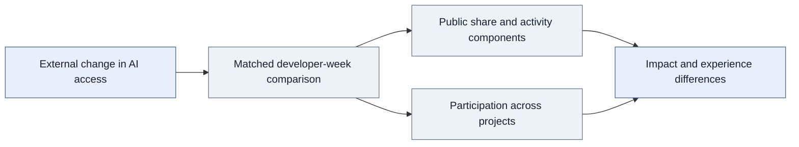

<div align="center">

# Does AI Increase Participation in Shared Projects?

A quasi-experiment on how AI access changes contribution patterns and new-project participation across users.

**Quasi-experimentation · Causal inference · Conditional logistic regression · Behavioral analytics**

[Overview](#project-overview) · [Experiment](#quasi-experimental-design) · [Impact](#impact-on-user-participation) · [Modeling](#modeling-new-project-participation) · [Code](#explore-the-implementation)

</div>

## Project overview

**I used a quasi-experiment to estimate how access to an AI product changes where users contribute and whether they engage with new projects. I then examined how these responses differ by developer experience.**

Italy's temporary ChatGPT suspension created an external change in product availability. I compared developer behavior in Italy with behavior in France and Portugal before and during the interruption to estimate the effect of changed access.

The analysis connects two levels of behavior: the share of activity directed toward public rather than private contribution, and the decision to enter another project. For a product team, this answers **whether the product changes participation, which behaviors account for that change, and which users respond**.

## Quasi-experimental design

| Design element | Implementation |
|---|---|
| Product and external event | ChatGPT's temporary access suspension in Italy |
| Treatment group | Developers in Italy |
| Comparison group | Developers in France and Portugal |
| Outcome panel | Developer-week public and private activity |
| Causal approach | Pre-treatment matching and difference-in-differences |
| Adjustment and inference | Developer and week fixed effects; developer-clustered standard errors |
| Additional behavioral model | **Conditional logistic regression on a user-project-week panel** |

I matched developers using pre-treatment profile and behavior measures, then compared changes across countries. The manuscript uses a Poisson framework and reports incidence-rate ratios. This was an externally occurring quasi-experiment, not a randomized product rollout. The treatment captures country-level availability; individual ChatGPT usage is not directly observed.



## Impact on user participation

| Finding | What changed |
|---|---|
| **Approximately 3% relative decrease in public share during lost access** | A smaller fraction of observed contribution was public |
| **Reduced public work drove the decrease** | The response reflected lower public contribution rather than increased private activity |
| **AI access broadened cross-project engagement** | The response extended to participation breadth, alongside activity composition |
| **Stronger allocation response among more experienced developers** | Product impact differed across experience groups |

The public-share estimate is a relative change, not a three-percentage-point decrease. Effects were concentrated in codification-intensive activities and the breadth of cross-project engagement.

**The product insight is behavioral:** access affected both where users contributed and the breadth of their participation. These are observed contribution outcomes, not estimates of retention, time spent, or revenue.

### How the outcomes were constructed

I aggregated seven public activity types: repository creation, commits, pull requests, reviews, discussion initiation, discussion answers, and issues.

```text
public_share = public_contributions / (public_contributions + private_contributions)
```

I analyzed the ratio alongside public and private counts, then decomposed public contribution by activity type. This identifies which behaviors explain the overall movement. Private activity measures do not imply access to private code or its contents.

The public example treats zero-total weeks as undefined shares and rejects missing counts. This is an illustrative policy, not the confidential final inclusion rule. The [metric dictionary](data-dictionary.md) explains denominator handling and aggregation with labeled synthetic examples.

## Modeling new-project participation

### **Conditional logistic regression: from activity totals to user choices**

**I modeled new-project entry on a user-project-week panel using conditional logistic regression.** This examines a specific behavioral decision underlying participation breadth: whether a user engages with a new project. I investigated differences by developer experience alongside the aggregate allocation analysis.

The discrete-choice model complements the quasi-experimental analysis. It should not be read as a predictive benchmark; no out-of-sample performance score is claimed for this model.

<details>
<summary><strong>Technical detail: choice sets and identification</strong></summary>

The representative sample uses developer-week conditioning groups. Eligible alternatives must be defined using information available before the decision. Groups with no outcome variation do not identify coefficients, and group-constant regressors cannot be estimated separately. Interactions must vary across alternatives to explain relative preference.

These details describe the public illustration, not a recovered specification of the proprietary entry model. The sample itself does not implement causal effect estimation. See [project-entry design](project_entry.py).

</details>

## How impact varies across users

The allocation response was stronger among more experienced developers, and the project-entry analysis examined differences in cross-project engagement by experience. This shows why a population-average estimate is only part of the product-impact story.

The interpretation is specific to the measured behavior: a larger change in public share does not establish that a segment receives more value on every outcome. These findings can inform hypotheses for segment-specific product evaluations; they do not establish a tested targeting policy.

## Assessing the interpretation

| Consideration | Implication |
|---|---|
| Counterfactual trends | The comparison group must represent what would have happened without the interruption |
| Observed matching | Improves comparability but cannot remove unobserved differential shocks |
| Ratio decomposition | A share alone cannot reveal which component changed |
| Collection completeness | Missing records must not become apparent inactivity |
| Choice-set construction | Future-informed alternatives can leak outcomes into the entry model |
| Behavioral proxies | Counts do not directly measure effort intensity or contribution value |

## My contribution and data scope

I led question formulation, outcome construction, data preparation, matching, causal estimation, **conditional-logit modeling**, validation, and interpretation.

The shared research infrastructure covers approximately **680,000 developers, 2 million repositories, and 13.6 million user-week observations**. These totals describe the broader data resource; matching and eligibility determine this study's model-specific samples.

The result is evidence about **how AI access changes participation and how that response differs across users**, supported by an analysis of both aggregate behavior and project-entry decisions.

## Explore the implementation

> **Research status and code availability:** The research is currently under review. The full research code and data are proprietary and are not distributed here. The public code consists only of selected, simplified samples of the general workflow; it is not the complete research implementation or a replication package.

| Sample | What to inspect |
|---|---|
| [Modular data collection](data-collection.md) | Study-specific collection stages, multithreading, validation, PostgreSQL persistence, and recovery |
| [Metric dictionary](data-dictionary.md) | Definitions, denominator policies, and labeled synthetic examples |
| [Allocation features](allocation_features.py) | Public counts and share construction |
| [Project-entry design](project_entry.py) | Conditional-logit illustration and within-group variation |
| [Effect interpretation](effect_interpretation.py) | Relative effects versus percentage-point changes |
| [Methodology](methodology.md) | Causal design, decomposition, and project choice |

<details>
<summary><strong>Research source and sample scope</strong></summary>

This case study presents my contributions to collaborative doctoral research at UC Irvine, focused on quasi-experimental product impact analysis. The underlying study is *Generative AI and Effort Allocation in Knowledge Work*.

Public files include selected refactored examples and representative reconstructions. They do not reproduce the research estimates. See [code provenance and scope](code-notes.md).

</details>

---

**Sardar Fatooreh Bonabi** · Data Science · University of California, Irvine  
[GitHub](https://github.com/SardarBonabi/) · [LinkedIn](https://www.linkedin.com/in/sardarb/)
